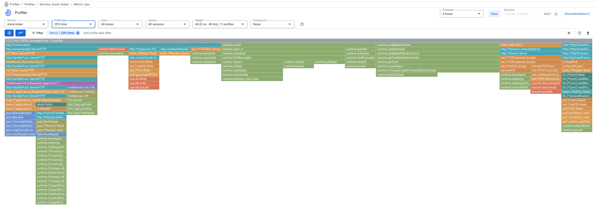
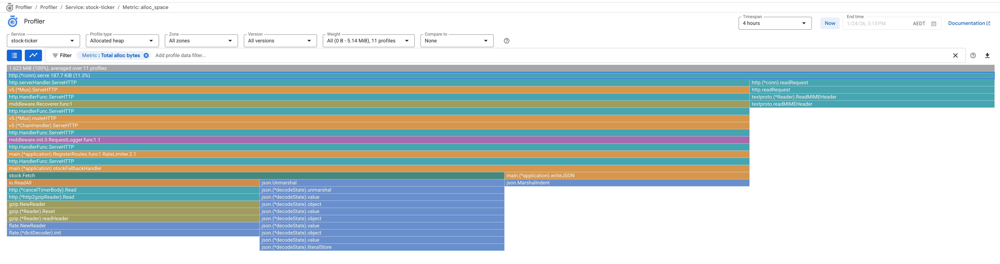

# Cloud Profiler

This page showcases Profiler features implemented in this project.

Brendan Gregg, a visionary and forefather of system performance, first come up with Flame Graphs a long, long time ago: https://www.brendangregg.com/flamegraphs.html

Since then it is used as foundation in numerous performance products, which offer intergration and additional features on top of it.

GCP did a very good job integrating it seamlessly, it just works: https://docs.cloud.google.com/profiler/docs/profiling-go and Profiler product page enables engineers to deep-dive and slice the data easily.

## Locally

To use Google Cloud Profiler, it is not required to run the application in GCP. It can just as easily collect data from application running locally, just need to provide it with `PROJECT_ID` where you have api enabled and permission to write data to it.

In this project this is achieved with providing env variables:

```bash
GCP_PROJECT_ID=<YOUR_PROJECT> ENABLE_CLOUDPROFILER=true go run ./cmd/api
```

You'll see log informing that profiler has started:
```
2026/01/24 17:14:32 Cloud Profiler started
2026/01/24 17:14:32 Starting server on :8080
2026/01/24 17:14:46 "GET http://localhost:8080/v1/stock-fallback HTTP/1.1" from [::1]:51782 - 200 417B in 179.064208ms
2026/01/24 17:14:47 "GET http://localhost:8080/v1/stock-fallback HTTP/1.1" from [::1]:51986 - 200 417B in 10.624834ms
```

The navigate to `Profiler` page in the GCP console: https://console.cloud.google.com/profiler

## Examples

### CPU Time



### Allocated Heap


