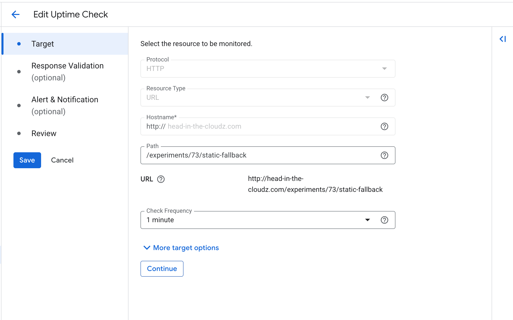
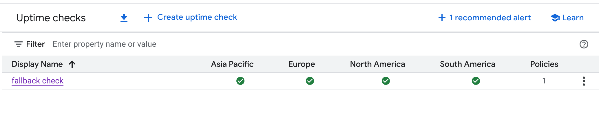
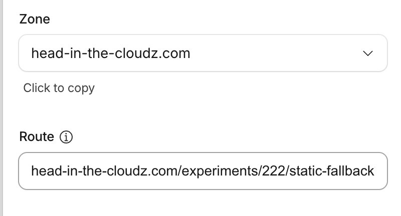
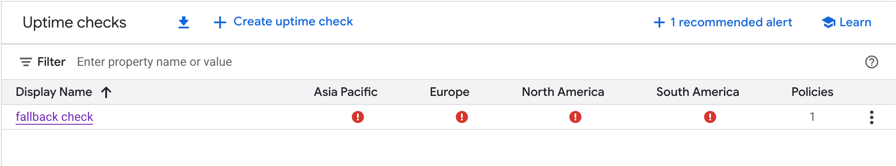

# GCP Uptime Check for Fallback URL

To ensure the reliability of our service, we depend on our fallback mechanism. A critical part of this is the availability of the static fallback URL. To monitor this dependency, we've configured a GCP Uptime Check.

This automated check periodically sends a request to our fallback URL to ensure it's available and responding correctly. If the check fails, GCP will trigger an alert, allowing us to address the issue proactively.

This is a great example of applying SRE principles to manage and monitor external dependencies.

## Configuration and Verification

Here is a walkthrough of the setup and a demonstration of a failure scenario.

### 1. Uptime Check Configuration

First, we configure the uptime check in the Google Cloud Console, specifying the URL to monitor.

### 2. Successful Verification

Once configured, the uptime check runs and confirms that the fallback URL is responding successfully.

### 3. Simulating a Failure

To test our monitoring, we can simulate a failure. In this case, we can temporarily make the fallback URL unavailable or cause it to return an error.

### 4. Failure Detection

The GCP Uptime Check quickly detects the failure and reports the error, which would trigger our configured alerts.

This ensures that we are always aware of the health of our critical dependencies, allowing us to maintain a high level of reliability for our users.
